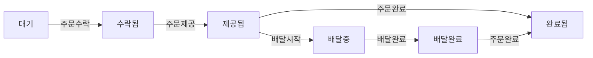
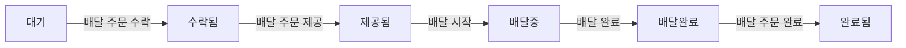

# 키친포스

## 퀵 스타트

```sh
cd docker
docker compose -p kitchenpos up -d
```

## 요구 사항

#### Product : 상품 관리

> **상품이란?**  
> 아메리카노, 참치 샌드위치, 팥 붕어빵 과 같은 개별 상품을 의미합니다.  
> 상품을 판매하기 위해서는 메뉴와 메뉴 그룹을 구성해야 합니다.  (하단 메뉴 관리, 메뉴 그룹 관리 항목을 참고해주세요.)

* 상품 등록하기
  * 이름과 가격을 입력할 수 있다
  * 이름에는 비속어와 같이 부적절한 단어는 사용할 수 없다
  * 이름은 반드시 입력해야 합니다
  * 상품의 가격은 0원 이상이어야 한다
* 상품 가격 변경하기
  * 상품의 가격은 0원 이상이어야 한다
  * 상품의 총합이 메뉴의 가격보다 작다면 유효하지 않은 메뉴가 된다
  * 유효하지 않은 메뉴는 노출하지 않는다 (내린다)
* 상품 조회하기
  * 상품 목록을 조회할 수 있다

#### Menu : 메뉴 관리

> **메뉴란?**  
> 아메리카노 1잔과 참치 샌드위치 1개 를  묶어 “참치모닝 1번 세트” 라는 메뉴로  구성할 수 있습니다.  
> 물론, 아메라카노 1잔만 메뉴로 등록이 가능합니다  
> 상품을 판매하기 위해서는 메뉴로 등록을 해야 합니다  
> 메뉴는 포함된 상품 가격의 총합보다 할인된 가격으로 팔 수 있습니다. 하지만, 더 비싼 가격으로 팔 수는 없습니다.

* 메뉴 등록하기
  * 이름과 가격을 입력할 수 있다
  * 이름에는 비속어와 같이 부적절한 단어는 사용할 수 없다
  * 이름은 반드시 입력해야 합니다
  * 1개 이상의 상품을 등록해야 한다
  * 상품의 갯수는 0개 이상 입력해야 한다
  * 메뉴 가격은 0 이상이어야 한다
  * 메뉴의 가격은 등록된 상품의 총합보다 높을 수 없다
  * 메뉴는 하나의 메뉴그룹에 속한다
  * 메뉴 등록할때 전시를 할지 말지를 정할 수 있다
* 메뉴 가격 변경하기
  * 메뉴 가격은 0 이상이어야 한다
  * 메뉴의 가격은 등록된 상품의 총합보다 높을 수 없다
* 메뉴 전시하기
  * 메뉴를 전시할 수 있다
  * 전시될 메뉴의 가격은 등록된 상품의 총합보다 높을 수 없다
  * 메뉴를 전시하면 손님에게 메뉴가 보이게 된다
* 메뉴 내리기
  * 메뉴를 내릴 수 있다
  * 메뉴를 내리면 손님에게 메뉴를 보여주지 않는다
* 메뉴 조회하기
  * 메뉴 목록을 조회할 수 있다

#### MenuGroup : 메뉴 그룹 관리

> **메뉴그룹이란?**  
> 여러 메뉴를 그룹으로 묶어서 관리할 수 있습니다.

* 메뉴그룹 등록하기
  * 이름을 등록할 수 있다
  * 이름은 반드시 입력해야 합니다
  * 이름에는 비속어와 같이 부적절한 단어는 사용할 수 없다
* 메뉴그룹 조회하기
  * 메뉴 그룹 목록을 조회할 수 있다

#### OrderTable : 주문 테이블 관리

> **주문 테이블이란?**  
> 매작식사를 하는 손님은 테이블에 배정되어야 합니다.
> 계산은 테이블에서 주문한 내역으로 이루어 집니다.

* 주문 테이블 등록하기
  * 주문 테이블의 이름을 입력할 수 있다
  * 이름은 반드시 입력해야 합니다
  * 처음 등록시 해당 테이블은 비어있는 좌석으로 등록한다
* 테이블에 손님 배정하기
  * 손님이 테이블에 앉으면 해당 테이블은 사용중 상태가 된다
* 테이블에 손님 수 변경하기
  * 테이블이 사용중이라면 앉은 손님의 수를 변경할 수 있다
  * 손님의 수는 0명 이상 입력해야 한다.
* 테이블 정리하기
  * 주문이 끝난 테이블은 초기화 한다
  * (미사용 상태로 변경하고, 앉은 손님의 수를 0으로 초기화한다)
* 주문 테이블 조회하기
  * 주문 테이블 목록을 조회할 수 있다

#### Order : 주문 관리

> **주문이란?**  
> 손님은 메뉴를 구매하기 위해 주문을 합니다.  
> 주문 유형으로는 매장 식사, 포장, 배달을 선택할 수 있습니다.

** 주문 상태 흐름도 **
- 주문 상태를 변화를 이해하기 위한 흐름도 입니다.
- 주문 생성을 하면 최초 상태는 대기 상태가 됩니다.



* 주문 생성하기
  * 주문 유형은 매장 식사, 포장, 배달 중 하나로 지정해야 한다.
  * 주문 항목은 1개 이상 포함되어야 한다.
  * 배달, 포장 주문인 경우 주문한 메뉴의 수량이 음수가 아니어야 한다.
  * 주문 항목에 포함된 메뉴는 반드시 전시 중 상태여야 한다.
  * 주문 항목의 가격은 메뉴에 설정된 가격과 동일해야 한다.
  * 매장 식사 주문의 경우, 주문 테이블을 반드시 지정해야 한다.
  * 매장 식사 주문의 경우, 테이블이 사용 중 상태여야 한다.
  * 배달 주문의 경우, 배송 주소를 필수로 입력해야 한다
  * 주문 상태는 “대기” 상태가 된다
* 주문 수락하기
  * 주문 상태가 "대기" 상태인 경우에만 수락할 수 있다.
  * 배달 주문의 경우, 배달업체에 총 주문 금액과 배송 주소를 포함하여 배달 요청을 한다.
* 주문 제공하기
  * 주문 상태가 "수락됨" 상태인 경우에만 제공할 수 있다.
  * 주문 상태가 “제공됨” 상태가 된다
* 배달 시작하기
  * 주문 유형이 배달이고, 주문 상태가 "제공됨" 상태인 경우에만 배달을 시작할 수 있다.
  * 배달 시작 시 주문 상태를 "배달 중"으로 변경한다.
* 배달 완료하기
  * 주문 상태가 "배달 중" 상태인 경우에만 배달을 완료할 수 있다.
  * 배달 완료 시 주문 상태를 "배달 완료"로 변경한다.
* 주문 완료하기
  * 주문 유형에 따라 다음 상태인 경우에만 완료할 수 있다:
  * 배달: 주문 상태가 "배달 완료"인 경우.
  * 매장 식사 또는 포장: 주문 상태가 "제공됨"인 경우.
  * 매장 식사 주문 완료 시, 해당 테이블에 미완료된 주문이 없다면 테이블 상태를 초기화(미사용 상태 및 손님 수 0)한다.
* 주문 목록 조회하기
  * 주문 목록을 조회할 수 있다

## 용어 사전

### 상품 (Product)

| 한글명   | 영문명           | 설명                                    |
|-------|---------------|---------------------------------------|
| 상품    | Product       | 판매되는 개별적인 품목으로 메뉴를 구성하는 요소            |
| 상품 이름 | Product Name  | 상품의 이름으로 반드시 입력되어야 하며 비속어를 사용할 수 없다   |
| 비속어  | Profanity     | 비속어는 불쾌감을 주는 단어나 문구를 의미한다. |
| 상품 가격 | Product Price | 상품의 가격. 메뉴에 등록된 가격은 상품의 가격보다 같거나 낮을 수 있다 |
| 상품 목록 | Product List  | 등록된 상품의 목록                            |

### 메뉴 그룹 (Menu Group)

| 한글명      | 영문명             | 설명                                       |
|----------|-----------------|------------------------------------------|
| 메뉴 그룹    | Menu Group      | 메뉴를 그룹화하는 단위 (예 - 치킨류, 사이드메뉴, 세트메뉴, 신메뉴) |
| 메뉴 그룹 이름 | Menu Group Name | 메뉴 그룹의 이름으로 반드시 입력되어야 하며 비속어를 사용할 수 없다   |
| 비속어  | Profanity     | 비속어는 불쾌감을 주는 단어나 문구를 의미한다. |
| 메뉴 그룹 목록 | Menu Group List | 등록된 메뉴 그룹의 목록                            |

### 메뉴 (Menu)

| 한글명   | 영문명          | 설명                                 |
|-------|--------------|------------------------------------|
| 메뉴    | Menu         | 하나 이상의 상품으로 구성된 판매 단위              |
| 메뉴 이름 | Menu Name    | 메뉴의 이름으로 반드시 입력되어야 하며 비속어를 사용할 수 없다 |
| 비속어   | Profanity     | 비속어는 불쾌감을 주는 단어나 문구를 의미한다. |
| 메뉴 가격 | Menu Price   | 메뉴의 가격                             |
| 메뉴 목록 | Menu List    | 등록된 메뉴의 목록                         |
| 메뉴 노출 | Display Menu | 손님이 메뉴를 볼 수 있게 함                   |
| 메뉴 숨김 | Hide Menu    | 손님이 메뉴를 볼 수 없게 함                   |

### 주문 테이블 (Order Table)

| 한글명       | 영문명              | 설명                                       |
|-----------|------------------|------------------------------------------|
| 주문 테이블    | Order Table      | 매장에서 주문을 처리하는 물리적인 테이블                   |
| 주문 테이블 이름 | Order Table Name | 주문 테이블 의 이름으로 반드시 입력되어야 하며 비속어를 사용할 수 없다 |
| 비속어       | Profanity        | 비속어는 불쾌감을 주는 단어나 문구를 의미한다.               |
| 주문 테이블 목록 | Order Table List | 등록된 주문 테이블의 목록                           |
| 빈 테이블     | Empty Table      | 현재 사용 중이지 않은 주문 테이블                      |
| 방문한 손님 수  | Number of Guests | 주문 테이블에 앉아 있는 손님 수                       |
| 사용 중     | Used             | 주문 테이블에 손님이 배정되어 사용 중인 상태                |

### 주문 (Order)

| 한글명     | 영문명               | 설명                                                                      |
|---------|-------------------|-------------------------------------------------------------------------|
| 주문      | Order             | 손님이 요청한 메뉴의 집합으로 주문 유형과 주문 상태를 가진다                                      |
| 주문 가격   | Order Price       | 주문에 포함된 하나 이상의 주문 항목 가격의 합                                              |
| 주문 항목   | Order Line Item   | 주문에 포함된 메뉴와 수량                                                          |
| 주문 목록   | Order List        | 등록된 주문의 목록                                                              |
| 미완료된 주문 | Uncompleted Order | 주문이 완료되지 않은 상태                                                          |

### 매장 식사 주문 (Eat In Order)

| 한글명         | 영문명            | 설명                                          |
|-------------|----------------|---------------------------------------------|
| 매장 식사 주문    | Eat In Order   | 주문 유형으로 매장 식사를 선택한 주문                       |
| 매장 식사 주문 상태 | Order Status   | 주문의 진행 상태                                   |
| 대기          | Waiting        | 주문이 생성되어 수락되기를 기다리는 상태                      |
| 수락됨         | Accept         | 주문이 수락되어 요리가 완료 되기를 기다리는 상태                 |
| 제공됨         | Served         | 주문된 요리가 완료되어 주문 테이블이나 배달원에게 전달된 상태          |
| 완료          | Completed      | 주문이 완료된 상태. 매장 식사가 완료되고 결제가 완료됨             |
| 주문 생성하기     | Create Order   | 손님이 메뉴를 선택하여 주문을 생성하는 작업으로 주문 상태는 대기가 된다    |
| 주문 수락하기     | Accept Order   | 대기 중인 주문을 수락하여 요리를 시작하는 작업으로 주문 상태는 수락됨이 된다 |
| 주문 제공하기     | Serve Order    | 요리가 완료되어 손님에게 제공하는 작업으로 주문 상태는 제공됨이 된다      |
| 주문 완료하기     | Complete Order | 주문이 최종적으로 완료된 상태로 변경하는 작업으로 주문 상태는 완료가 된다   |

### 포장 주문 (Take Out Order)

| 한글명      | 영문명            | 설명                                                                      |
|----------|----------------|-------------------------------------------------------------------------|
| 포장 주문    | Take Out Order | 주문 유형으로 포장을 선택한 주문                                                      |
| 포장 주문 상태 | Order Status   | 주문의 진행 상태                                                               |
| 대기       | Waiting        | 주문이 생성되어 수락되기를 기다리는 상태                                                  |
| 수락됨      | Accept         | 주문이 수락되어 요리가 완료 되기를 기다리는 상태                                             |
| 제공됨      | Served         | 주문된 요리가 완료되어 주문 테이블이나 배달원에게 전달된 상태                                      |
| 완료       | Completed      | 주문이 완료된 상태. 결제가 완료처리 된 것을 포함. 매장 식사는 식사완료, 포장은 포장 완료, 배달은 배달이 완료되어야 한다. |
| 주문 생성하기  | Create Order   | 손님이 메뉴를 선택하여 주문을 생성하는 작업으로 주문 상태는 대기가 된다                                |
| 주문 수락하기  | Accept Order   | 대기 중인 주문을 수락하여 요리를 시작하는 작업으로 주문 상태는 수락됨이 된다                             |
| 주문 제공하기  | Serve Order    | 요리가 완료되어 손님에게 제공하는 작업으로 주문 상태는 제공됨이 된다. 배달 주문의 경우 배달 기사에게 전달됩니다         |
| 주문 완료하기  | Complete Order | 주문이 최종적으로 완료된 상태로 변경하는 작업으로 주문 상태는 완료가 된다 (매장 식사, 포장, 배달 모두 포함)         |

### 배달 주문 (Delivery Order)

| 한글명      | 영문명               | 설명                                                                      |
|----------|-------------------|-------------------------------------------------------------------------|
| 배달 주문    | Delivery Order    | 주문 유형으로 배달을 선택한 주문                                                      |
| 배달 주문 상태 | Order Status      | 주문의 진행 상태                                                               |
| 대기       | Waiting           | 주문이 생성되어 수락되기를 기다리는 상태                                                  |
| 수락됨      | Accept            | 주문이 수락되어 요리가 완료 되기를 기다리는 상태                                             |
| 제공됨      | Served            | 주문된 요리가 완료되어 주문 테이블이나 배달원에게 전달된 상태                                      |
| 배달 중     | Delivering        | 배달 주문이 배달 중인 상태                                                         |
| 배달 완료    | Delivered         | 배달 주문이 배달 완료된 상태                                                        |
| 주문 완료    | Completed         | 주문이 완료된 상태. 결제가 완료처리 된 것을 포함. 매장 식사는 식사완료, 포장은 포장 완료, 배달은 배달이 완료되어야 한다. |
| 주문 생성하기  | Create Order      | 손님이 메뉴를 선택하여 주문을 생성하는 작업으로 주문 상태는 대기가 된다                                |
| 주문 수락하기  | Accept Order      | 대기 중인 주문을 수락하여 요리를 시작하는 작업으로 주문 상태는 수락됨이 된다                             |
| 주문 제공하기  | Serve Order       | 요리가 완료되어 손님에게 제공하는 작업으로 주문 상태는 제공됨이 된다. 배달 주문의 경우 배달 기사에게 전달됩니다         |
| 배달 시작하기  | Start Delivery    | 배달 주문의 경우, 완료된 요리를 손님에게 배달하는 작업으로 주문 상태는 배달 중이 된다                       |
| 배달 완료하기  | Complete Delivery | 배달 주문이 고객에게 전달된 상태로 변경하는 작업으로 주문 상태는 배달 완료가 된다                          |
| 주문 완료하기  | Complete Order    | 주문이 최종적으로 완료된 상태로 변경하는 작업으로 주문 상태는 완료가 된다 (매장 식사, 포장, 배달 모두 포함)         |
| 배달 주소    | Delivery Address  | 배달 주문인 경우 배달 받을 주소                                                      |
| 배달 대행사   | Delivery Agency   | 배달을 수행하는 외부 대행사 또는 내부 배달 조직                                             |

## 모델링

### Product : 상품 관리

속성
* `상품 등록 정책` : 
  * `Product Name`은 반드시 입력해야 한다
  * `Product Name`에는 `Profanity`를 사용할 수 없다.
  * `Product Price`는 반드시 입력해야 한다.
  * `Product Price`는 0원 이상어야한다.

행위
* `Product` 등록은 `상품 등록 정책`을 만족시켜야 한다
* `Product Price`를 변경할 수 있다.
  * `Product Price`를 변경할 땐 0원 이상 입력하여야 한다.
* `Product List`를 조회할 수 있다

### MenuGroup : 메뉴 그룹 관리

속성
* `메뉴 그룹 등록 정책` : 
  * `Menu Group Name`은 반드시 입력해야 한다
  * `Menu Group Name`에는 `Profanity`를 사용할 수 없다.

행위
* `Menu Group` 등록은 `메뉴 그룹 등록 정책`을 만족시켜야 한다
* `Menu Group List`를 조회할 수 있다

### Menu : 메뉴 관리

속성
* `메뉴 등록 정책` : 
  * `Menu Name`은 반드시 입력해야 한다
  * `Menu Name`에는 `Profanity`를 사용할 수 없다.
  * `Menu Price`는 반드시 입력해야 한다.
  * `Menu Price`는 0원 이상어야한다.
  * `Menu`는 `Menu Products`를 포함해야 한다
  * `Menu`는 `Menu Products`의 `Total Product Price` 보다 `Menu Price`가 작아야 한다
  * `Menu`는 하나 이상의 `Menu Group`에 속한다

행위
* `Menu` 등록은 `메뉴 등록 정책`을 만족시켜야 한다
* `Menu Price`를 변경할 수 있다.
  * `Menu Price`를 변경할 땐 0원 이상 입력하여야 한다.
  * `Menu Price`가 `Menu Products`의 `Total Product Price` 보다 크면 `Menu`는 `Hide Menu`가 된다.
* `Menu`는 `Display Menu`로 변경할 수 있다
* `Menu`는 `Hide Menu`로 변경할 수 있다
* `Menu List`를 조회할 수 있다

### Eet In Order : 매장 식사 주문 관리

속성
* `주문 테이블 등록 정책` :
  * `Order Table Name`은 반드시 입력해야 한다
  * `Order Table Name`에는 `Profanity`를 사용할 수 없다.
* `매장 식사 주문 생성 정책` : 
  * `Order Item`이 1개 이상 포함되어야 한다.
  * `Order Item`에 포함된 `Menu`는 반드시 `Display Menu`여야 한다.
  * `Order Item`의 가격은 `Menu`에 설정된 가격과 동일해야 한다.
  * `Order Table`을 반드시 지정해야 한다.

행위
* `Order Table` 등록은 `주문 테이블 등록 정책`을 만족시켜야 한다
  * `Order Table`을 처음 등록할때는 `Empty Table`로 등록한다
* `Order Table`의 `Number of Guests`를 변경할 수 있다
  * `Order Table`의 `Number of Guests`를 변경할 땐 0명 이상 입력해야 한다
  * `Empty Table`은 `Number of Guests`를 변경할 수 없다.
* `Order Table List`을 조회할 수 있다
* `Eet In Order`을 생성하기 위해서는 `매장 식사 주문 생성 정책`을 만족시켜야 한다
* `Eet In Order`을 생성하면 `Order Status`는 `Waiting`이 된다 
* `Eet In Order`의 `Order Status`는 다음과 같이 진행된다.
    ```mermaid
      graph LR
      A[Waiting] --Accept Order--> B[Accept];
      B --Served Order--> C[Served];
      C --Complete Order--> F[Completed];
    ``` 
* `Eet In Order`가 완료되어 `Uncompleted Order`가 없다면 `Empty Table`로 변경 한다
* `Eet In Order List`를 조회할 수 있다

### Take Out Order : 포장 주문 관리

속성
* `포장 주문 생성 정책` : 
  * `Order Item`은 1개 이상 포함되어야 한다.
  * `Order Item`에 포함된 `Menu`는 반드시 `Display Menu` 상태여야 한다.
  * `Order Item`의 가격은 `Menu`에 설정된 가격과 동일해야 한다.
  * `Order Item`의 수량은 음수가 아니어야 한다.

행위
* `Take Out Order`을 생성하기 위해서는 `포장 주문 생성 정책`을 만족시켜야 한다
* `Take Out Order`을 생성하면 `Order Status`는 `Waiting`이 된다
* `Take Out Order`의 `Order Status`는 다음과 같이 진행된다.
    ```mermaid
      graph LR
      A[Waiting] --Accept Order--> B[Accept];
      B --Served Order--> C[Served];
      C --Complete Order--> F[Completed];
    ``` 
* `Take Out Order List`를 조회할 수 있다

### Delivery Order : 배달 주문 관리



속성
* `배달 주문 생성 정책` : 
  * `Order Item`은 1개 이상 포함되어야 한다.
  * `Order Item`에 포함된 `Menu`는 반드시 `Display Menu` 상태여야 한다.
  * `Order Item`의 가격은 `Menu`에 설정된 가격과 동일해야 한다.
  * `Order Item`의 수량은 음수가 아니어야 한다.
  * `Delivery Address`를 반드시 입력해야 한다

행위
* `Delivery Order`를 생성하기 위해서는 `배달 주문 생성 정책`을 만족시켜야 한다
* `Delivery Order`을 생성하면 `Order Status`는 `Waiting`이 된다
* `Delivery Order`의 `Order Status`는 다음과 같이 진행된다.
  ```mermaid
    graph LR
    A[Waiting] --Accept Order--> B[Accept];
    B --Served Order--> C[Served];
    C --Start Delivery--> D[Delivering];
    D --Complete Delivery--> E[Delivered];
    E --Complete Order--> F[Completed];
  ``` 
* `Delivery Order List`를 조회할 수 있다